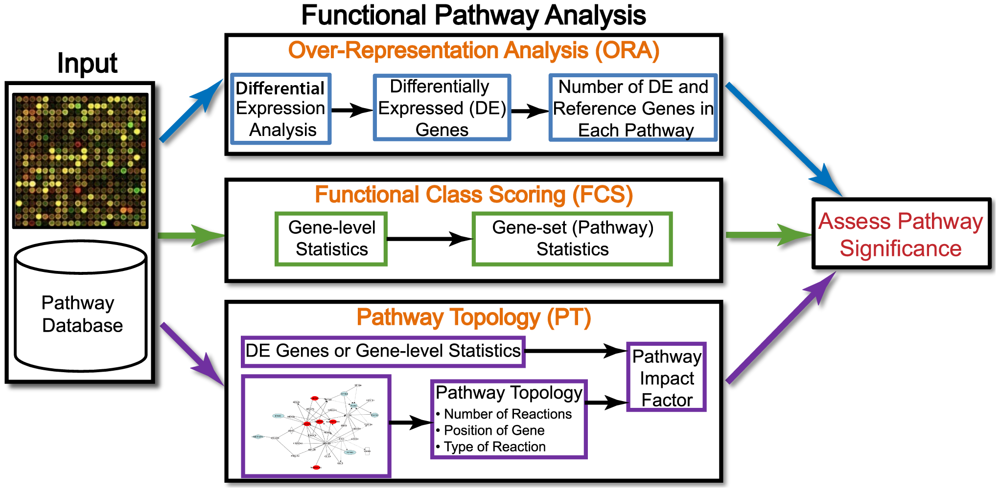
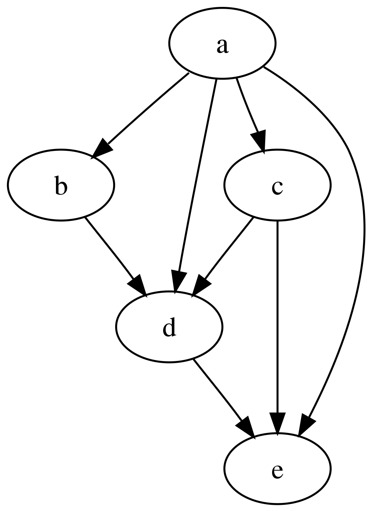
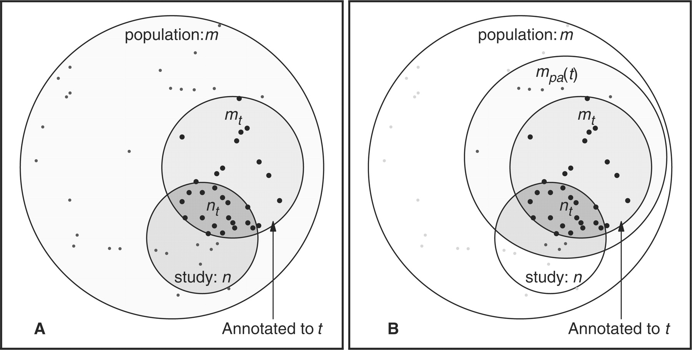
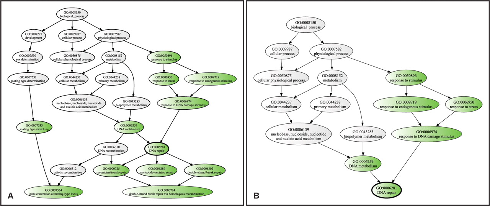
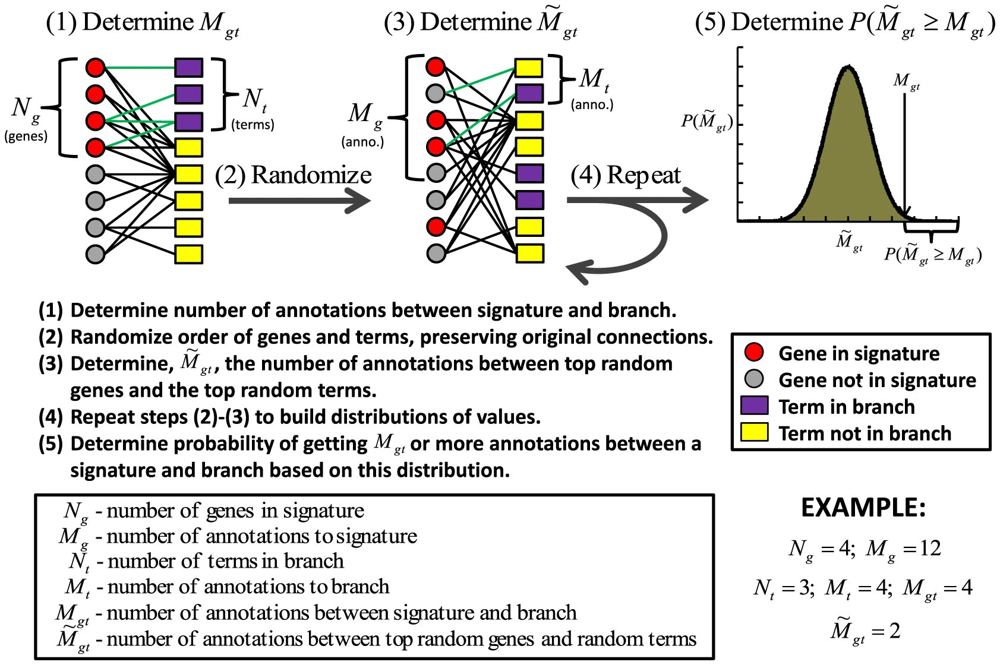
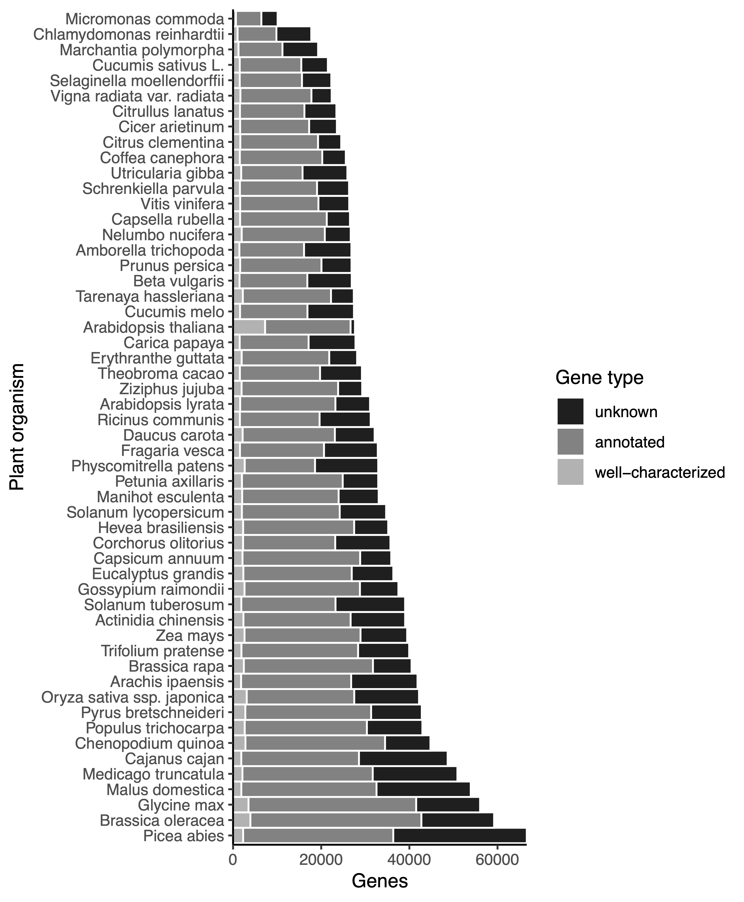
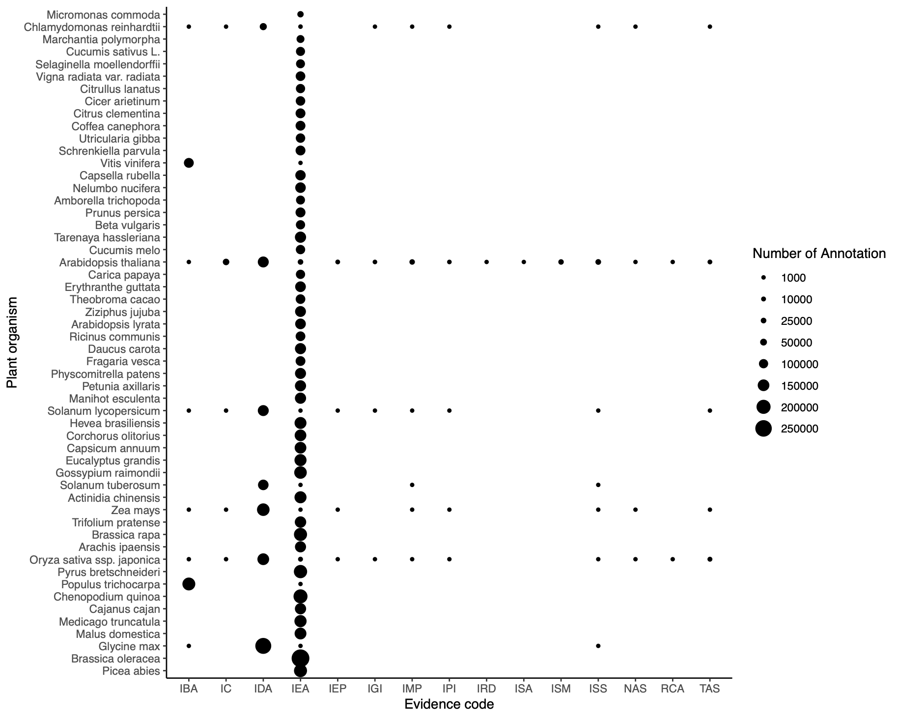

<!-- todo move the heavy lifting from the setup chunk to dedicated exercise.setup calls -->

```{r setup, include=FALSE}
# to run locally replace tutorials/04_gene_set_enrichment_analysis/www with inst/tutorials/04_gene_set_enrichment_analysis/www

# to run as an app replace tutorials/04_gene_set_enrichment_analysis/www with www

# libraries
suppressPackageStartupMessages({
  library(DOSE)
  library(dplyr)
  library(enrichplot)
  library(ggplot2)
  library(here)
  library(learnr)
  library(org.Hs.eg.db)
  library(readr)
  library(tibble)
  library(topGO)
  library(UpSetR)
})

# options
knitr::opts_chunk$set(echo = FALSE)
tutorial_options(
  exercise.reveal_solution=TRUE,
  exercise.lines=5)

# setup
load(here("tutorials/04_gene_set_enrichment_analysis/www/data.rda"))

# step to reproduce
# ---
# G03_vs_G02_at_T04_simple <- read_tsv(file=here("tutorials/04_gene_set_enrichment_analysis/www/analysis/G03_vs_G02_at_T04_simple-model_DE-results.tsv"),show_col_types=FALSE)
# population <- G03_vs_G02_at_T04_simple %>% filter(!is.na(padj)) %>% dplyr::select(geneID,padj,log2FoldChange)
# population.score <- population$padj
# names(population.score) <- sub("\\.\\d+","",population$geneID)
# getDEgenes <- function(allScore){
#   alpha=0.01
#   return(allScore <= alpha)
# }
# alpha=0.01
# lfc=0.5
# population.score[abs(population$log2FoldChange) <= lfc] <- 1
# GOdata <- new("topGOdata",
#               description = "G03 vs. G02 at T04 (simple model)",
#               ontology = "BP",
#               allGenes = population.score,
#               geneSel = getDEgenes,
#               nodeSize = 5,
#               annot = annFUN.org,
#               mapping="org.Hs.eg.db",
#               ID="ensembl")
# 
# test.stat <- new("parentChild",testStatistic = GOFisherTest, name = "Parent Child")
# resultPC <- getSigGroups(GOdata, test.stat)
# FDR <- p.adjust(score(resultPC),method="BH")
# 
# classicFisher <- runTest(GOdata,algorithm="classic",statistic="fisher")
# elimFisher <- runTest(GOdata,algorithm="elim",statistic="fisher")
# parentchildFisher <- runTest(GOdata,algorithm="parentchild",statistic="fisher")
# weight01Fisher <- runTest(GOdata,algorithm="weight01",statistic="fisher")
# 
# symbols <- select(org.Hs.eg.db,keys=names(population.score),columns="SYMBOL",keytype="ENSEMBL")
# symbols <- symbols[!duplicated(symbols$ENSEMBL),]
# 
# input <- population %>% mutate(
#   gene_ids=symbols$SYMBOL[match(sub("\\.\\d+","",geneID),symbols$ENSEMBL)],
#   is_candidate=ifelse(!is.na(padj) &
#                         padj <= 0.01 &
#                         abs(log2FoldChange) > 0.5,1,0)) %>%
#   filter(! is.na(gene_ids)) %>%
#   dplyr::select(gene_ids,is_candidate) %>% as.data.frame()
# 
# goFunc <- go_enrich(input, n_randsets=100,orgDb='org.Hs.eg.db',domains="biological_process")
# res <- goFunc$results[order(goFunc$results$FWER_overrep),]
# sel <- res$FWER_overrep <=0.01
#
# entrez <- select(org.Hs.eg.db,keys=names(population.score),
#                  columns="ENTREZID",keytype="ENSEMBL")
# 
# entrez <- entrez[!duplicated(entrez$ENSEMBL),]
# 
# stopifnot(all(names(population.score) == entrez$ENSEMBL))
# 
# de <- population.score
# 
# names(de) <- entrez$ENTREZID
# 
# geneList <- population$log2FoldChange
# names(geneList) <- names(de)
# 
# tab <- table(names(geneList)) 
# 
# duplicates <- geneList[names(geneList) %in% names(tab)[tab==2]]
# boxplot(split(duplicates,names(duplicates)),las=2)
# 
# geneList <- geneList[order(abs(geneList))]
# geneList <- geneList[!duplicated(names(geneList))]
# 
# edo <- enrichDGN(names(de)[de <= 0.01])
# 
# edo2 <- gseDO(sort(geneList,decreasing=TRUE))
#
# edox <- setReadable(edo, 'org.Hs.eg.db', 'ENTREZID')
#
# save(G03_vs_G02_at_T04_simple,
#      population,population.score,
#      GOdata,resultPC,FDR, getDEgenes,
#      G03_vs_G02_at_T04, alpha, lfc,
#      fpopulation,fpopulation.score,
#      fGOdata,classicFisher,
#      elimFisher,parentchildFisher,
#      weight01Fisher,comp, goFunc,
#      res, sel,
#      symbols,input,entrez,
#      de, geneList, edo, edo2, edox,
#      file=here("tutorials/04_gene_set_enrichment_analysis/www/data.rda"))
```

## Introduction

Now that we have run the Differential Expression Analysis, what do we do with our results?

Mostly, you will select a few candidates and do functional characterisation in the lab, right?

So you went ballistic and did a whole genome analysis only to look at a couple genes?

There must be another way to look at the data! Gene Set Enrichment Analysis (GSEA) is one possibility.

GSEA aims at answering the question: is my list of genes (the gene set) associated with the experimental condition? For example, "are there unusually many de-regulated genes in my gene list?" or "is my DE gene list enriched for some functional processes?".

Let us load the DE data we generated. The file is in "tutorials/04_gene_set_enrichment_analysis/www/analysis/G03_vs_G02_at_T04_simple-model_DE-results.tsv".

```{r load, exercise=TRUE, exercise.eval=FALSE}

```

```{r load-hint}
# you should not need hints anymore, do you?
?read_tsv
```

```{r load-solution}
G03_vs_G02_at_T04_simple <- read_tsv(file=here("tutorials/04_gene_set_enrichment_analysis/www/analysis/G03_vs_G02_at_T04_simple-model_DE-results.tsv"),show_col_types=FALSE)
```

Now, that we have restored the DE results in `R` from our simpler model data analysis (T04 only modeled as `~treatment`), we can start to do a gene ontology enrichment. There are many ways to do so, and many online tools too, but for now, we will use a `R` package called `topGO`. `topGO` is a package that was developed at the time when expression profiling was done on microarray and while the package is still relevant nowadays, the documentation has aged and is far from being comprehensive.

## Gene Set Enrichement Analysis

There are many Gene Set Enrichement Analysis (GSEA) methods, Bioconductor had as of November 2022, [146](http://bioconductor.org/packages/release/BiocViews.html#___GeneSetEnrichment) packages flagged as GSEA capable.

Still, most of these rely on three approaches, reviewed in [Khatri et al., 2012](https://journals.plos.org/ploscompbiol/article?id=10.1371/journal.pcbi.1002375). These are:

* Over-representation analysis (ORA): are differentially expressed (DE) genes in the set more common than expected from the population?
* Functional class scoring (FCS): summarize statistic of DE of genes in a set, and compare to a null (typically permutation of the sample labels)
* Pathway topology (PT): include pathway knowledge in performing FCS, _e.g._ the number and type of interactions between gene products

{width=80%}

You are probably already familiar with a number of tools and websites that offer GSEA, for example, [KEGG](https://www.genome.jp/kegg/), [Reactome](https://reactome.org/), and most certainly you have have heard or read about [Gene Ontology](http://geneontology.org/) enrichment. Let's have a GO at the later (sorry, bad pun...)

## Gene Ontology Enrichment

### Gene Ontology

Gene Ontology (GO) is a controlled vocabulary that assign to a gene one-to-many:

* Biological Process(es)
* Cellular Component(s)
* Molecular Function(s)

The vocabulary is hierarchical, organised as a [directed acyclic graph](https://en.wikipedia.org/wiki/Directed_acyclic_graph) (DAG)

{width=50%}

As one goes further away from the DAG root or its second highest level terms Biological Process, Cellular Component and Molecular Function, terms get more and more specific.

### Enrichment

#### Over Representation Analysis

Gene Ontology Enrichment is commonly an Over Representation Analysis (ORA)) where we look for the over representation of Gene Ontology (GO) terms in a **set** of genes as compared to the rest of the **population**.

A classical approach is a statistical analysis based on the one-sided Fisher's exact test (hypergeometric distribution).

| |gene set|population|total|
| :---: | :---: | :---: | :---: |
|DE|k|K-k|K|
|notDE|n-k|N+k-n-K|N-K|
|total|n|N-n|N|

```{r population-quizz}
quiz(caption="A 'population'?",
     question("What is it?",
              answer("All the genes of the organism of interest"),
              answer("All the genes expressed in the study",
                     correct=TRUE),
              answer("All the genes not in the gene-set")
     ))
```

There are some caveats with the fisher test too. [Bauer S. _et al._, 2008](https://academic.oup.com/bioinformatics/article/24/14/1650/182451) expresses it this way:

_A disadvantage of this method_ (Fisher's one sided exact test) _is that it ... disregards dependencies related to annotations ... a gene which is annotated to t is also annotated to all parent ... This leads to a problem if we consider multiple terms simultaneously: the chance of t being enriched is much higher if one or more of its parental terms is enriched._

In other words, enrichment can propagate downwards through the DAG GO graph. To address this, [Grossmann _et al._,2007](https://academic.oup.com/bioinformatics/article/23/22/3024/208216) and Bauer _et al._, proposed and implemented the `Parent-Child` test.

{width=80%}

{width=80%}

Clearly the Parent-Child approach by considering the context of the enrichment might prevent the propagation of enrichment down the DAG tree.

---

#### Functional Class Scoring

There are other methods that have been developed to perform GO Enrichment, some of them using the Functional Class Scoring (FCS) GSEA approach, _e.g._ [Glass and Girvan, 2014](https://www.nature.com/articles/srep04191)

{width=80%}

---

#### Other limitations

Gene ontology annotation (and any other annotation for that matter) are commonly inferred electronically from model organism.

Does it matter? Yes. Take a look at the figure below showing the quality of the GO annotation of all plant species present in the PLAZA database. _Well characterized_ means that a gene is associated with 10 GO terms or more.

{width=80%}

Only the model organism _Arabidopsis thaliana_ is decently annotated. If we look into further details at the type of annotation, the vast majority of plants, but the most studied ones, have only annotation of the type "Inferred from Electronic Annotation" (IEA).

{width=80%}

```{r limitation-quizz}
quiz(caption="Limitations",
     question("Which of the following are limitations of a GSEA?",
              answer("The annotation are partial",correct=TRUE),
              answer("The database are only informed by what scientists study",correct=TRUE),
              answer("Model organism suffer from a lack of annotation",correct=TRUE),
              answer("Model organism suffer from a lack of manually verified annotation",correct=TRUE),
              try_again=TRUE,
              post_message="And the list goes on and on..."
     ))
```

### TopGO
#### Population

As we have seen, there are a number of aspects we will need to manage, including the choice of test (Parent-Child if available) and the definition of the population.

We start with the latter. Use the following code block to extract the population we will compare our set to. Just a few reminders, the population cannot be the whole gene catalog, as not all genes are expressed. Then, should genes that are expressed below the signal to noise cutoff even be considered? After-all they are uninformative. One way to identify the genes rejected by DESeq() during its independent filtering step is to look for genes which have a `NA` value as their FDR (padj). Use the following block to define your population.

```{r population, exercise=TRUE, exercise.eval=FALSE}

```

```{r population-hint-1}
?filter
?is.na
```

```{r population-hint-2}
G03_vs_G02_at_T04_simple %>% filter(!is.na(padj))
```

```{r population-solution}
# a more advanced solution, keeping only the columns of interest
population <- G03_vs_G02_at_T04_simple %>% filter(!is.na(padj)) %>% dplyr::select(geneID,padj,log2FoldChange)
```

Next, we will set up the objects needed for `topGO`. That information was devised from the `topGo` package vignette.

#### Score
We need to have a vector that contains the scores (_e.g._ padj), as a named vector. The names need to be the gene ID that will be present in our GO annotation.

```{r genelist, exercise=TRUE, exercise.eval=FALSE}
population.score <- population$padj
names(population.score) <- sub("\\.\\d+","",population$geneID)
```

#### Significance
We need a function to define the genes / scores that are significant

```{r genesel, exercise=TRUE, exercise.eval=FALSE}
getDEgenes <- function(allScore){
  alpha=0.01
  return(allScore <= alpha)
}
```

However, what we would really need (review Schurch _et al._, RNA, 2016) is both a cutoff on the FDR and log2 fold-changes. The `topGO` design is not flexible enough to allow for that (we can have only one score), so we work our way around that. We change all FDR that corresponds to genes which |log2FC| is below 0.5 to 1.

```{r lfc, exercise=TRUE, exercise.eval=FALSE}
lfc=0.5
population.score[abs(population$log2FoldChange) <= lfc] <- 1
```

#### Annotation

Finally, we need to define which Annotation to use. There the documentation of `topGO` is laconic. I figured out that we can use the `org` annotation package from Bioconductor, provide them as a `mapping` and define which `ID` should be used to identify the genes:

1. `annot = annFUN.org`
2. `mapping="org.Hs.eg.db"`
3. `ID="ensembl"`

#### Bringing it all together

<!-- TODO hints -->

```{r go, exercise=TRUE, exercise.eval=FALSE, exercise.timelimit=300, exercise.lines=15}
library(topGO)
library(org.Hs.eg.db)
GOdata <- new("topGOdata",
              description = "G03 vs. G02 at T04 (simple model)",
              ontology = "BP",
              allGenes = population.score,
              geneSel = getDEgenes,
              nodeSize = 5,
              annot = annFUN.org,
              mapping="org.Hs.eg.db",
              ID="ensembl")
```

#### Testing

Now that the object is set up (it has retrieved the annotation and linked our gene set), we can define the testing. `topGO` supports the `Parent Child` test, but again, it took a while to find that information.

```{r test, exercise=TRUE, exercise.eval=FALSE, exercise.timelimit=300}
test.stat <- new("parentChild",testStatistic = GOFisherTest, name = "Parent Child")
resultPC <- getSigGroups(GOdata, test.stat)
```

#### Multiple testing correction.

Observe the `topGO` package does not do any multiple testing correction by default (it was very debated back then and the arguments of the authors are still valid). As this is nonetheless IMO recommendable, we run a Benjamini-Hochberg correction:

```{r mtest, exercise=TRUE, exercise.eval=FALSE}
FDR <- p.adjust(score(resultPC),method="BH")
```

#### Results

That's it! We have performed our enrichment! Let's look at the results:


```{r results, exercise=TRUE, exercise.eval=FALSE}
score(resultPC)
geneData(resultPC)
alpha=0.01
summary(FDR <= alpha)
```

### Visualisation
It is always interesting to visualise results both for assessing and explaining them

---

#### Assessment

```{r visualisation, exercise=TRUE, exercise.eval=FALSE}

hist(score(resultPC),100)

```

---

#### Exploration

```{r exploration, exercise=TRUE, exercise.eval=FALSE}

suppressPackageStartupMessages(showSigOfNodes(GOdata, score(resultPC), firstSigNodes = 5, useInfo = 'def'))

suppressPackageStartupMessages(showSigOfNodes(GOdata, FDR, firstSigNodes = 5, useInfo = 'def'))

printGraph(GOdata, resultPC, firstSigNodes = 5, fn.prefix = "tGO", useInfo = "def", pdfSW=TRUE)

```

---

There are many other alternatives to visualise data, so let us export our results

```{r export, exercise=TRUE, exercise.eval=FALSE}
alpha=0.01
enr <- tibble(ID=names(FDR)[FDR <= alpha],
       FDR=FDR[FDR<=alpha])
```

```{r write, eval=FALSE, echo=TRUE}
dir.create(here("inst/tutorials/04_gene_set_enrichment_analysis/www/analysis/GO"),showWarnings=FALSE)
write_tsv(enr,file=here("inst/tutorials/04_gene_set_enrichment_analysis/www/analysis/GO/G03_vs_G02_at_T04_simple-model_GO-enrichment.tsv"))
```

Now that we have exported the data, we can use them in other resources, one that I like is [REVIGO](http://revigo.irb.hr). Let's have a look.

## Hands-on

Reproduce the analysis above, but run it on the full model data ("tutorials/04_gene_set_enrichment_analysis/www/analysis/G03_vs_G02_at_T04_full-model_DE-results.tsv").

1. We gather the data

```{r full-model-data, exercise=TRUE, exercise.eval=FALSE, exercise.lines=30, exercise.timelimit=600}

```

```{r full-model-data-solution}
# data
G03_vs_G02_at_T04 <- read_tsv(file=here("tutorials/04_gene_set_enrichment_analysis/www/analysis/G03_vs_G02_at_T04_full-model_DE-results.tsv"),show_col_types=FALSE)

# population
fpopulation <- G03_vs_G02_at_T04 %>% filter(!is.na(padj)) %>% dplyr::select(geneID,padj,log2FoldChange)
fpopulation.score <- fpopulation$padj
names(fpopulation.score) <- sub("\\.\\d+","",fpopulation$geneID)
fpopulation.score[abs(fpopulation$log2FoldChange) <= lfc] <- 1

# topGO data
fGOdata <- new("topGOdata",
              description = "G03 vs. G02 at T04 (full model)",
              ontology = "BP",
              allGenes = fpopulation.score,
              geneSel = getDEgenes,
              nodeSize = 5,
              annot = annFUN.org,
              mapping="org.Hs.eg.db",
              ID="ensembl")

```

2. We run the test

```{r full-model, exercise=TRUE, exercise.eval=FALSE, exercise.lines=30, exercise.timelimit=600}

```

```{r full-model-solution}
# test statistics
test.stat <- new("parentChild",testStatistic = GOFisherTest, name = "Parent Child")

# Do the test
resultPC <- getSigGroups(fGOdata, test.stat)

# Adjust for multiple testing
FDR <- p.adjust(score(resultPC),method="BH")
```

3. We visualise

```{r full-model-view, exercise=TRUE, exercise.eval=FALSE}
# Plot
suppressPackageStartupMessages(showSigOfNodes(GOdata, FDR, firstSigNodes = 5, useInfo = 'def'))
```

## Methods comparison

Are the `parent-child` results significantly different than the default of *topGO*, _i.e._ `weight01`? What about the `classic` and `elim` methods?

But, first of all, how did I know about these methods? Mostly by searching on Bioconductor and reading the package [vignette](https://bioconductor.org/packages/release/bioc/html/topGO.html). The package has two functions that can be used to retrieve a list of existing enrichment algorithms and tests.

```{r algo, exercise=TRUE, exercise.eval=FALSE}
whichAlgorithms()
whichTests()
```

### Many algorithms
Now that we know about the possibilities, and after taking a look at the vignette's **Table 1**, we can select a number of algorithms to run and the `fisher` test (as it is the only test supported by all algorithms). **For the sake of the time, run just one, or be ready to wait five minutes...**

```{r tests, exercise=TRUE, exercise.eval=FALSE, exercise.timelimit=300}
classicFisher <- runTest(GOdata,algorithm="classic",statistic="fisher")
elimFisher <- runTest(GOdata,algorithm="elim",statistic="fisher")
parentchildFisher <- runTest(GOdata,algorithm="parentchild",statistic="fisher")
weight01Fisher <- runTest(GOdata,algorithm="weight01",statistic="fisher")
```

The `topGO` package offers a lot of functionalities, including a method to extract the results of a test: `GenTable`. That function is actually very versatile and could be used to compare different sets of results, _e.g._:

```{r comparison, exercise=TRUE, exercise.eval=FALSE, exercise.lines=10}

comp <- as_tibble(GenTable(GOdata,classicFisher=classicFisher,
         elimFisher=elimFisher,
         parentchildFisher=parentchildFisher,
         weight01Fisher=weight01Fisher,
         orderBy="parentchildFisher",
         topNodes=sum(p.adjust(score(parentchildFisher),method="BH") <= 0.01)))
```

Now that we built a comparison of three methods against the `parentchild` reference, let us visualise the results of the overlap. This is usually done using Venn diagrams, but these quickly turn cumbersome to interpret and are hard to draw for more than five sets. Instead, a more generic visualisation are the `upset` plots from the library [UpSetR](https://cran.r-project.org/web/packages/UpSetR/index.html). The `upset` function expects a list of numerical vectors, where an overlap is represented by the same value being present across multiple lists - see the [Basic Usage](https://cran.r-project.org/web/packages/UpSetR/vignettes/basic.usage.html) vignette. We will use `dplyr` to extract the data from the results of `GenTable` and turn it into a boolean matrix.

```{r upset, exercise=TRUE, exercise.eval=FALSE, exercise.lines=12}
library(UpSetR)

comp <- as_tibble(GenTable(GOdata,classicFisher=classicFisher,
         elimFisher=elimFisher,
         parentchildFisher=parentchildFisher,
         weight01Fisher=weight01Fisher,
         orderBy="parentchildFisher",
         topNodes=sum(p.adjust(score(parentchildFisher),method="BH") <= 0.01)))

dat <- comp %>% dplyr::select(contains("Fisher") & -starts_with("Rank")) %>% 
  mutate_if(is.character,parse_double) %>% 
  mutate_all("<",0.01)

# a quick estimation
dat %>% summarise(across(everything(),sum))

# creating the list and plotting
upset(fromList(apply(dat,2,which)))

```

It seems that the `classic` and `parentchild` are very similar, while the `elim` and `weight01` are much more conservative. The vignette from the `topGO` package has a section arguing (mostly) against multiple testing correction. Redo the previous analysis, without the multiple testing correction.

```{r comp2, exercise=TRUE, exercise.eval=FALSE, exercise.lines=15}

```

```{r comp2-solution}
comp <- as_tibble(GenTable(GOdata,classicFisher=classicFisher,
         elimFisher=elimFisher,
         parentchildFisher=parentchildFisher,
         weight01Fisher=weight01Fisher,
         orderBy="parentchildFisher",
         topNodes=sum(score(parentchildFisher) <= 0.01)))

dat <- comp %>% dplyr::select(contains("Fisher") & -starts_with("Rank")) %>% 
  mutate_if(is.character,parse_double) %>% mutate_all("<",0.01)
dat %>% summarise(across(everything(),sum))

upset(fromList(apply(dat,2,which)))

```

This is not much different as an outcome. Both the `elim` and `weight01` function are more conservative. Not knowing which method to choose, one would often resort to doing some sort of benchmarking in addition to literature screening.

### Benchmarking

There are numerous possibilities for running a GO enrichment analysis in R. A quick search reveals numerous packages, _e.g._ [GOfuncR](https://bioconductor.org/packages/release/bioc/vignettes/GOfuncR/inst/doc/GOfuncR.html), [simplifyEnrichment](https://bioconductor.org/packages/simplifyEnrichment/), [ViSEAGO](https://bioconductor.org/packages/ViSEAGO), [clusterProfiler](https://bioconductor.org/packages/release/bioc/html/clusterProfiler.html), _etc._

Many of these will depend on annotations, so before proceeding, let us have a quick peek at annotations

---

#### Annotations

Most (model) organisms will have annotation available at [Bioconductor](http://bioconductor.org/packages/release/BiocViews.html#___Organism). It is a huge ecosystem of packages and there are many ways to create the annotation one needs for use in `R`. This is outside the topic of this tutorial, but just for reference, one entry point would be the [AnnotationForge](http://bioconductor.org/packages/release/bioc/html/AnnotationForge.html)
 package. For access to more annotation, not only those listed at Bioconductor, the [AnnotationHub](http://bioconductor.org/packages/release/bioc/html/AnnotationHub.html) package. Both these packages and most of the ecosystem relies on the [AnnotationDBi](http://bioconductor.org/packages/release/bioc/html/AnnotationDbi.html) package: _Annotation DB interface_. That package has few functions to manipulate annotations: `colums`, `keys`, `keytypes`,  and `select`. 
 
In the following example, we load the whole genome annotation for human: [org.Hs.eg.db](http://bioconductor.org/packages/release/data/annotation/html/org.Hs.eg.db.html). `eg` stands for `Entrez gene` and represent the primary key used in these annotation. [Entrez](https://www.ncbi.nlm.nih.gov/Web/Search/entrezfs.html) is NCBI's molecular biology database system.

Use the afore-mentioned functions to list all fields of the database, take a look at the keys and key types and retrieve all gene symbols from our `population.score` object (note that our Identifiers are from ENSEMBL).


```{r annotation, exercise=TRUE, exercise.eval=FALSE, exercise.lines=10}
library(org.Hs.eg.db)

```

```{r annotation-hint-1}
?columns
?keys
?keytypes
?select
```

```{r annotation-hint-2}
org.Hs.eg()
select(org.Hs.eg.db,keys=...,columns=...,keytype=...)
```

```{r annotation-solution}
columns(org.Hs.eg.db)
head(keys(org.Hs.eg.db))
keytypes(org.Hs.eg.db)
symbols <- select(org.Hs.eg.db,keys=names(population.score),columns="SYMBOL",keytype="ENSEMBL")
(symbols <- symbols[!duplicated(symbols$ENSEMBL),])
```

_Note: The issues raised in that paper from 2006: [Babel's tower revisited: a universal resource for cross-referencing across annotation databases](https://academic.oup.com/bioinformatics/article/22/23/2934/278068) are still very much actual. There are many databases, many IDs ultimately containing the same information, still navigating cross-references between them is as tricky as ever._ Hence the last line in the solution above, which is here arbitrarily dropping some of the IDs we retrieve. This is of course suboptimal and one would want a more robust approach to select. Again, this is rather outside the scope of the present tutorial.

---

#### Testing methods

Now that we know a bit more about annotations, let us try the `GOfuncR` package. Following the instructions [there](https://bioconductor.org/packages/release/bioc/vignettes/GOfuncR/inst/doc/GOfuncR.html#core-function-go_enrich) and the example [there](https://bioconductor.org/packages/release/bioc/vignettes/GOfuncR/inst/doc/GOfuncR.html#hypergeometric-test-using-a-defined-background-gene-set) we can set up the object and perform the enrichment. 

```{r gofuncr, exercise=TRUE, exercise.eval=FALSE, exercise.timelimit=300, exercise.lines=12}
library(GOfuncR)
input <- population %>% mutate(
  gene_ids=symbols$SYMBOL[match(sub("\\.\\d+","",geneID),symbols$ENSEMBL)],
  is_candidate=ifelse(!is.na(padj) &
                        padj <= 0.01 &
                        abs(log2FoldChange) > 0.5,1,0)) %>%
  filter(! is.na(gene_ids)) %>%
  dplyr::select(gene_ids,is_candidate) %>% as.data.frame()

goFunc <- go_enrich(input, n_randsets=100,orgDb='org.Hs.eg.db',domains="biological_process")
```

_Note:_

1. _This probably felt much easier than `topGO`_
2. _You might be unfamiliar with the notation `package::function`? It is to ensure that when multiple packages are loaded that use the same function name, i.e. `select` here, we use the right one: `dplyr::select`_

Let us take a look at the results. The documentation helps us understand the content of the object.

```{r gofuncr-result, exercise=TRUE, exercise.eval=FALSE}
# content
str(goFunc)
# significant terms
sum(goFunc$results$FWER_overrep <=0.01)

```

We can do some assessment of the results, namely the p-value and FWER distribution. Both should be mostly uniform.

```{r gofuncr-assess, exercise=TRUE, exercise.eval=FALSE}
hist(goFunc$results$raw_p_overrep,100)
hist(goFunc$results$FWER_overrep,100)
```

Finally, we can do some visualisation of the results

```{r gofuncr-view, exercise=TRUE, exercise.eval=FALSE, exercise.lines=12, exercise.timelimit=300}

res <- goFunc$results[order(goFunc$results$FWER_overrep),]

sel <- res$FWER_overrep <=0.01

plot_stats <- plot_anno_scores(goFunc, res$node_id[sel])

go_IDs <- plot_stats[order(plot_stats$odds_ratio,decreasing=TRUE),"go_id"][1:4]

plot_anno_scores(goFunc, go_IDs)

res[res$node_id %in% go_IDs,]

```

---

#### Comparing

Now that we ran two tools and many methods, we can find out how they overlap.

```{r method-comp, exercise=TRUE, exercise.eval=FALSE}

comp <- as_tibble(GenTable(GOdata,classicFisher=classicFisher,
         elimFisher=elimFisher,
         parentchildFisher=parentchildFisher,
         weight01Fisher=weight01Fisher,
         orderBy="parentchildFisher",
         topNodes=sum(p.adjust(score(parentchildFisher),method="BH") <= 0.01)))

comp$GO.ID %in% res$node_id

table(res$node_id[sel] %in% comp$GO.ID)

new.dat <- comp %>% full_join(res[sel,],by=c("GO.ID"="node_id")) %>% 
  dplyr::select(c("FWER_overrep",contains("Fisher") & -starts_with("Rank"))) %>% 
  mutate_if(is.character,parse_double) %>% 
  mutate_all("<=",0.01) %>% 
  rename(FWER_overrep="FUNC")

upset(fromList(apply(new.dat,2,which)),order.by="freq")
```

None of this looks very satisfying with different methods giving quite different results. This is not uncommon and unless some researchers did a proper benchmarking, it is hard to assess which method is best. To address that limitation, there are approaches that gather an _"ensemble"_ of methods. Such ensemble are commonly more robust in their prediction than any of the individual methods. This will be the topic of the next tutorial. Meanwhile, let us take a look at some visualisation and other type of non-GO enrichment.

## Visualisation

There are many ways to visualise GO results, the following dot plot is very common and can easily be reproduced using tidyverse.

```{r result-visualisation, exercise=TRUE, exercise.eval=FALSE, exercise.lines=20 }

GenTable(GOdata,parentchild=parentchildFisher,topNodes=20) %>% 
  as_tibble() %>% 
  mutate(parentchild=parse_double(parentchild),
         GeneRatio=Significant/Expected) %>% 
  arrange(GeneRatio) %>% 
  mutate(GO.ID=factor(GO.ID,levels=GO.ID)) %>% 
  ggplot(aes(x = GeneRatio , 
             y = GO.ID, 
             color = parentchild, 
             size = Significant, 
             text=Term)) + 
  geom_point() +    
  scale_color_gradient(low = "red", high = "blue") +
  theme_bw() + 
  ylab("") + 
  xlab("Gene Ratio") + 
  ggtitle("GO enrichment analysis (BP - parent-child)")

```

We will see more visualisation, some of which can easily be adapted when working with other packages.

## Other GSEA

Gene Ontology enrichment is one type of (ORA - over representation analysis) Gene Set Enrichment Analysis. There are many many more. A good entry point in that world is the work of Guangchuang Yu and his collection of R packages nicely brought together in his online [book](https://yulab-smu.top/biomedical-knowledge-mining-book/index.html).

This package ecosystem relies on Entrez IDs. We will perform and visualise GSEA on different Disease Ontologies.

1. [DisGeNET: a discovery platform for the dynamical exploration of human diseases and their genes.](http://database.oxfordjournals.org/content/2015/bav028.long)
2. [DOSE: Disease Ontology Semantic and Enrichment analysis](http://dx.doi.org/10.1093/bioinformatics/btu684)

But first we transform our data in the [expected format](https://yulab-smu.top/biomedical-knowledge-mining-book/enrichplot.html) for the R package `enrichplot`.

The object we need for _1._ is similar to the one we used for `topGO` but with Entrez IDs as names instead.

```{r entrez-de, exercise=TRUE, exercise.eval=FALSE, exercise.lines=15}

entrez <- select(org.Hs.eg.db,keys=names(population.score),
                 columns="ENTREZID",keytype="ENSEMBL")

entrez <- entrez[!duplicated(entrez$ENSEMBL),]

stopifnot(all(names(population.score) == entrez$ENSEMBL))

de <- population.score

names(de) <- entrez$ENTREZID

head(de)

```

_Note: here again, we have a many to many mapping, which we need to resolve - very naively here!_

The object we need for _2._ is similar but should contain values centered on 0, in our case the log2 fold-changes.

```{r entrez-gene-list, exercise=TRUE, exercise.eval=FALSE, exercise.lines=15}

geneList <- population$log2FoldChange
names(geneList) <- names(de)

tab <- table(names(geneList)) 

duplicates <- geneList[names(geneList) %in% names(tab)[tab==2]]
boxplot(split(duplicates,names(duplicates)),las=2)

geneList <- geneList[order(abs(geneList))]
geneList <- geneList[!duplicated(names(geneList))]

head(geneList)
```

_Note: here again the same many-to-many issue, but at least here we take a look and it is not trivial to resolve! In our solution, we keep the entries with the largest absolute fold-change; again naively._

Now, we can conduct the GSEA on the Disease Gene Net.

```{r disGeNet, exercise=TRUE, exercise.eval=TRUE, exercise.timelimit=300}
library(DOSE)
library(enrichplot)

edo <- enrichDGN(names(de)[de <= 0.01])
barplot(edo, showCategory=20) 
```

As well as on the disease ontology. The previous method is a type of ORA, the second is a GSEA method of the competitive type (depends on a competitive null hypothesis which assumes the genes in a set do not have a stronger association with the experimental condition compared to randomly chosen genes outside the set)

```{r DOSE, exercise=TRUE, exercise.eval=TRUE}
edo2 <- gseDO(sort(geneList,decreasing=TRUE))
```

```{r DOSE-plot, exercise=TRUE, exercise.eval=TRUE}
dotplot(edo, showCategory=30) + ggtitle("dotplot for ORA")
```

```{r DOSE-plot-gsea, exercise=TRUE, exercise.eval=TRUE}
dotplot(edo2, showCategory=30) + ggtitle("dotplot for GSEA")
```

[Chapter 15](https://yulab-smu.top/biomedical-knowledge-mining-book/enrichplot.html) of **Guangchuang Yu**'s book has many many more examples of visualisation. 

---

#### Gene Concept Network

This visualisation shows the relationship between the semantic concepts and the genes in the form of a network
```{r cnetplot, exercise=TRUE, exercise.eval=TRUE}
## convert gene ID to Symbol
edox <- setReadable(edo, 'org.Hs.eg.db', 'ENTREZID')
cnetplot(edox, foldChange=geneList)
```

If such a visualisation becomes too complex, it can alternatively be viewed as a heatmap

```{r heatplot, exercise=TRUE, exercise.eval=TRUE}
heatplot(edox, foldChange=geneList, showCategory=5)
```

---

#### Treeplot

Alternatively, the concept-gene relationship can be used to build dendrograms representing the pairwise similarities of the enriched terms

**Note that this fails for some (mysterious reasons) combination of OS / architecture.**

```{r treeplot, exercise=TRUE, exercise.eval=FALSE}
edox2 <- pairwise_termsim(edox)
treeplot(edox2)
```

---

#### Enrichment plot

Enriched terms can also be visualised as enrichment map, _i.e._ a network of terms, with the hope that functional clusters can be identified.

```{r emap, exercise=TRUE, exercise.eval=TRUE}
edo <- pairwise_termsim(edo)
emapplot(edo)
```

#### Ridge plot

Another interesting visualisation is to associate the enrichment with the expression levels of member genes.

```{r ridgeplot, exercise=TRUE, exercise.eval=TRUE}
ridgeplot(edo2)
```

---

#### Running score and preranked list

This is a very frequent visualisation of a common GSEA approach, whereby _"GSEA first ranks the genes based on a measure of each gene's differential expression with respect to the two phenotypes (for example, tumor versus normal) or correlation with a continuous phenotype.  Then the entire ranked list is used to assess how the genes of each gene set are distributed across the ranked list.  To do this, GSEA walks down the ranked list of genes, increasing a running-sum statistic when a gene belongs to the set and decreasing it when the gene does not. The enrichment score (ES) is the maximum deviation from zero encountered during that walk.  The ES reflects the degree to which the genes in a gene set are overrepresented at the top or bottom of the entire ranked list of genes.  A set that is not enriched will have its genes spread more or less uniformly through the ranked list.  An enriched set, on the other hand, will have a larger portion of its genes at one or the other end of the ranked list. The extent of enrichment is captured mathematically as the ES statistic."_ from [genepattern.org](https://www.genepattern.org/modules/docs/GSEA/14).

```{r gseaplot2, exercise=TRUE, exercise.eval=TRUE}
gseaplot2(edo2, geneSetID = 1, title = edo2$Description[1])
```

```{r gseaplot2-2, exercise=TRUE, exercise.eval=TRUE}
gseaplot2(edo2, geneSetID = 1:3)
```

---

#### Pubmed trend

An important caveat of any GSEA is that it is inherently limited by the knowledge we have (_i.e_ the knowledge available in the literature, databases, _etc._). This is obviously easily biased when research focuses on very specific topic or is otherwise biased against race or gender... [no comment, that was in 2009...](https://gizmodo.com/until-2009-the-human-clitoris-was-an-absolute-mystery-5876335). Hence, a nice visualisation on how (un)frequently enriched terms are reported in the literature is a great sanity check... The following plots use Europe PubMed Central (`R` package `europepmc`) to retrieve that information.

```{r pmcplot, exercise=TRUE, exercise.eval=TRUE, exercise.timelimit=600}
terms <- edo$Description[1:5]
pmcplot(terms, 2010:2022)
```

```{r pmcplot2, exercise=TRUE, exercise.eval=TRUE, exercise.timelimit=600}
terms <- edo$Description[1:5]
pmcplot(terms, 2010:2022, proportion=FALSE)
```

These are just a couple examples of GSEA analysis that could be done, a simple [search](http://bioconductor.org/help/search/index.html?q=gsea/) for _gsea_ is enough to highlight the diversity available.

As often in bioinformatics, there are no simple single choice and one will need to rely on benchmarking and other metrics to make an initial pick. More integrated methods are developing and that will be the topic of the next tutorial.

## Session Info
It is good practice and highly recommended to always include the session info in your analyses. This way other can reproduce them with the exact same versions of the packages you used. Use the help to find out how to print the session info.

```{r session-info, exercise=TRUE, exercise.eval=TRUE}

```

```{r session-info-hint}
sessionInfo()
```

## Copyright
This material is provided under the following license:

`CC-BY-NC-SA 4.0:` _Creative Commons Attribution-NonCommercial-ShareAlike 4.0 International Public License_

<!-- Remember from Petri Törönen (UH)

3: Why I dislike MIT GSEA method (long story):
I noticed in my first enrichment article that there is something quite weird in that method. I looked at their mathematics then. (Not checking this now. Might have small errors here)
1. They calculate differential gene expression score per gene
2. They order genes with differential expression values (DEVs)
3. They take all genes of studied class X
4. They sum the absolute DEV of genes in X
5. They get score Y by dividing each DEV with this sum
6. They use Y as weight for each gene in X
....
Check the steps 4, 5 and 6. When gene gets a maximal weight? Lets take a group X_{test} that has small DEVs among its members. Take the gene Z with largest differential expression, and start increasing it. The larger the DEV of Z is in proportion to total sum of DEVs in X_{test}, the stronger the impact of Z is on the result. So a GO class with one strong outlier will get a really strong result!!!
-->